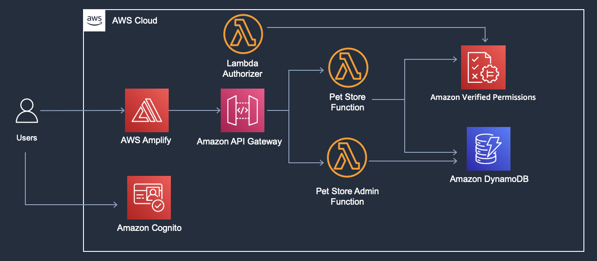

# Introduction

[](https://console.aws.amazon.com/amplify/home#/deploy?repo=https://github.com/aws-samples/avp-petstore-sample-v2)

This sample web application v2 demonstrates authentication and policy-based authorization of different user types to an imaginary Pet Store web app. This application uses Amazon Cognito for authentication and uses Amazon Verified Permissions for policy-based authorization, the application uses Amplify platform to accelerate deployment and provisioning of backend resources. To access sample v1 go to [avp-petstore-sample repo](https://github.com/aws-samples/avp-petstore-sample)

After successful deployment of the sample application into your environment, the architecture created is below:



The first step to test this sample application is to login to your AWS console then click the link above to deploy this sample application in your AWS account using Amplify hosting. This will also create backend resources needed for the application like Amazon Cognito user pool, API Gateway project and Lambda function to simulate backend service. Application will go through provision, build and deploy stages and might take several minutes to complete.


Follow the steps below to create users, associate usage plan to API Gateway Deployment, and create sample stores and franchises.

## Managing users and groups in Amazon Cognito

In this section, you will create users and groups, add custom attributes to the users and assign users to their groups to simulate customer and store owner personas.

1. Navigate to Amazon Cognito service in the AWS Console
2. Search for the [petstoresample...] Cognito User Pool that was created by Amplify, navigate to the Users tab and click on Create user button
3. We need to create 4 users to fully test the functionality of this application, a customer account, a store owner account, a franchise owner account, and "abhi" who represents a customer with an existing order.
    1. First lets create “abhi”. This will be used to test Customer-GetOrders policy which we will cover later in the Verified Permissions section of the setup guide. This username is hard coded as the order owner in Lambda code for demonestration purposes, so you need to create the user with the exact username.
    Create the user as explained in the screenshot below
    
  
    2. Similarly, create three more users with any usernames of your choice for the customer, store owner, and franchise owner personas
        1. Edit store-owner user to add custom attribute to indicate that they are an employee of a certain store, to do this first visit user profile by clicking on the username
        
        2. Click “Add Attribute” at the bottom of the screen and add the attribute and value below
        
4. Now we need to add these users to the appropriate group.
    1. These group names are part of the tokens issued by Cognito and will be used for Role-based access control (RBAC)
    2. The “Customer” group needs to include “abhi” and the other "Customer" user you have created
    3. The “StoreOwnerRole“ group should include the store-owner user with employmentStoreCode attribute
    4. The “FranchiseOwnerRole“ group should include the franchise-owner user with franchiseCode attribute

Cognito user pool now has the users and groups needed for demonestration of this application.

## Managing permissions in Amazon Verified Permissions

In this section, we will review Amazon Verified Permissions policy-store, schema and policies to represent the authorization model for the application.

### Schema

1. Navigate to Amazon Verified Permissions in the Console
2. Click on “Schema“ in the left menu
3. You will see a page like the following, review the schema created.


### Policies

1. Now click on “Policies” in the left menu
2. Review each of policies in the Policy Store

### Associate Usage Plan to API Gateway Deployment Stage

1. Navigate to API Gateway in the Console
2. Click on API "petstoreapi"
3. Click on Usage Plans on the left menu
4. Click on "usagePlanPetStore"
5. Click Add API Stage button under Associated API Stages section
6. Select "petstoreapi" for API from the dropdown and select the stage in the drop down. Click tick icon to save

### Add sample Store and Franchise in DyanmoDB tables

1. Navigate to Parameter Store in the Console
2. Click on "/avp-petstore-demo/{env}/ApiRootUrl" and "/avp-petstore-demo/{env}/ApiKey" and note down values
3. Open AWS CloudShell in the Console
4. Export APIKEY and APIROOTURL as variable

    ```
    export APIKEY=REPLACE_WITH_VALUE_OF /avp-petstore-demo/{env}/ApiKey from ParameterStore
    export APIROOTURL=REPLACE_WITH_VALUE_OF /avp-petstore-demo/{env}/ApiRootUrl from ParameterStore
    ```

5. Add sample stores using the API

   ```
   curl -X PUT -H "x-api-key: $APIKEY" -H "Content-Type: application/json" -d '{ "id": "petstore-london", "value":"London Petstore", "franchise": { "id": "petstoreFranchise" } }' $APIROOTURL/admin/store

   curl -X PUT -H "x-api-key: $APIKEY" -H "Content-Type: application/json" -d '{ "id": "petstore-austin", "value":"Austin Petstore", "franchise": { "id": "petstoreFranchise" } }' $APIROOTURL/admin/store
   ```

6. Add sample franchise using the API

   ```
   curl -X PUT -H "x-api-key: $APIKEY" -H "Content-Type: application/json" -d '{ "id": "petstoreFranchise", "value":"Petstore Franchise", "stores": [{ "id": "petstore-london" }, { "id": "petstore-austin" }]}' $APIROOTURL/admin/franchise
   ```

## Testing the Application

Petstore sample application allows a user to sign-in and take certain actions from the frontend, these actions send HTTPS requests to backend lambda function through API Gateway passing the user token as a form of authorization, backend lambda function extract information about the request, user token and the resource being accessd then create an authorization query to Amazon Verified Permissions to get a decision, based on the decision the call is allowed or denied by the backend lambda function.

You can review the backend lambda code by visiting [Petstoresample...] lamdba function that was created by Amplify in your AWS account.


### To test the application after successful deployment, follow these steps

1. Navigate to AWS Amplify and click on the avp-petstore-sample-v2 application
2. Select the link under your front end of the application in order to launch in another Tab the Application UI. This opens the web application on the sign-in screen.
3. First, login as "abhi" who is a customer with an existing order
    1. When you log in as a customer, you will see the “Customer role type actions“ menu. As you attempt each of the following actions, you will see authorization results on the right side of the screen with Allow or Deny decision from AVP and the corresponding reason.
    2. Select, Search Pets, and see the result on the right side. Next try Place order and view the result again.
    3. As you select View Order, as abhi, you will get a successful message like the one shown below, this is due to the fact that abhi is listed as the resource owner for the resource, order-1.
    
    4. Sign out of the abhi persona and lets move on to the next customer user.
4. Sign in as the 2nd Customer user.
    1. When you sign in, you will see the same “Customer role type actions“ menu as we did with the abhi persona.
    2. Select, Search Pets, and see the result on the right side. Next try Place order and view the result again. As before you will see a corresponding success as shown below.
    3. Now as you try View Order, you will get a Deny decision, this is due to the fact that this customer is NOT listed as the resource owner for the resource, order-1.
    
    4. Sign out of the customer 2 persona and lets move on to the store owner user.
5. Next, log in as the StoreOwner, try to list orders with and without defining the petstore-id in the input field (options are: “petstore-london“ and “petstore-austin”).
    
6. In the next test, we will limit store owner permissions to only the store they own, this change will add attribute-based access control to the store owner policy. Now when you try the application, if you put “petstore-austin” in the prompt box you will get a Deny and if you put “petstore-london” in the prompt box you will get an Allow. This is because the application is leveraging the “storeowner” attribute passed in the JWT to limit their access in accordance to the more restrictive Policy that identifies the specific store location the persona manages. Experiment with store owner with multiple stores by providing list of stores in comma separated value in Cognito user attribute e.g. "petstore-london,petstore-austin"
7. In the next test, we will test franchise owner permission. Check your franchise owner user has franchiseCode attribute set with "petstoreFranchise". Now when you try the application, if you put “petstore-austin” or “petstore-london” in the prompt box you will get an Allow as both the stores are part of the franchise.

## Clean Up

You can clean up the sample application from the account by deleting the Amplify Application.

Steps

1. You can delete the Amplify application by navigating to Amplify and clicking "Delete App" in the Actions dropdown


